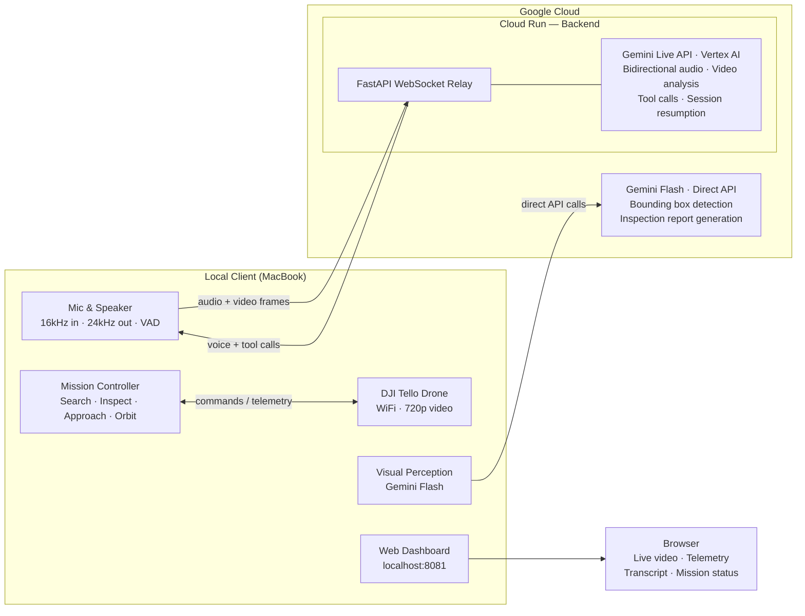

# Drone Copilot

**Voice-controlled drone copilot powered by Gemini Live API**

[](https://python.org)
[](https://ai.google.dev)
[](https://cloud.google.com/run)

Drone Copilot lets you have a natural voice conversation with a DJI Tello drone while it streams live video to Google's Gemini AI. Say "take off," ask "what do you see?", or command "find the red bag" — the AI responds verbally in real time, controls the drone, and autonomously searches for or inspects objects using computer vision.

<!--  -->

---

## Try it without a drone

No hardware required. The demo mode replays pre-recorded missions through the same dashboard used for live flights.

Two demos are included:

- **Open box** — two boxes sit on a table; Gemini correctly identifies the open one, autonomously flies to it, then follows manual voice commands.
- **Lego statue inspection** — Gemini autonomously orbits a Lego statue to inspect it. Two notes reading "Gemini" and "Live Challenge" are placed nearby; Gemini spots some of them during the inspection.

> **Note:** Demo files (images and telemetry) are stored in [Git LFS](https://git-lfs.com). Install it once with `git lfs install`, then run `git lfs pull` after cloning to download them.

```bash
# Install Git LFS (once — skip if already installed)
git lfs install

# Clone and install
git clone https://github.com/BryenInsights/drone-copilot.git
cd drone-copilot
git lfs pull  # download demo files

python3.13 -m venv .venv && source .venv/bin/activate
pip install -r client/requirements.txt

# Launch demo dashboard
python -m client.src.dashboard.demo_main
```

Open **http://localhost:8081** in your browser, select a demo, and click **Start**.

---

## Watch the demo

**Screen + dashboard view**

[](https://youtu.be/_FCgmYjGCVs)

**Outside view (iPhone)**

[](https://youtu.be/38d4ZavOyTw)

---

## How it works

Drone Copilot uses a **split architecture** to overcome a key hardware constraint: the DJI Tello drone creates its own WiFi network, which means the laptop controlling it loses internet access. The solution is a cloud backend.



- **Cloud Run backend** hosts a persistent Gemini Live API session (via Vertex AI) for real-time bidirectional audio and video streaming.
- **Local Python client** connects to the DJI Tello, captures audio/video, streams them to the backend over WebSocket, and executes validated drone commands.
- **Gemini Flash** handles visual perception — bounding box detection during autonomous missions and multi-angle inspection reports.
- **Web dashboard** provides real-time monitoring for observers.
- The Live API backend routes calls through Google Cloud (Vertex AI), with Cloud Run authenticating automatically via Application Default Credentials. The perception and report models call the Gemini API directly.

---

## Setup & run

### Prerequisites

- Python 3.13+
- Google Cloud project with Vertex AI enabled (or a Gemini API key)
- DJI Tello drone (optional — mock mode available)
- macOS with microphone and speakers
- Docker (for deployment)

### Quick start (mock drone, local backend)

```bash
# Clone
git clone https://github.com/BryenInsights/drone-copilot.git
cd drone-copilot

# Virtual environment
python3.13 -m venv .venv
source .venv/bin/activate

# Install dependencies
pip install -r client/requirements.txt
pip install -r backend/requirements.txt

# Configure client
cp client/.env.example client/.env
# Edit client/.env: set GEMINI_API_KEY

# Start backend (terminal 1)
uvicorn backend.src.main:app --host 0.0.0.0 --port 8080

# Start client (terminal 2)
python -m client.src.main

# Open dashboard
open http://localhost:8081
```

By default `USE_MOCK_DRONE=true` (no drone needed) and `BACKEND_URL=ws://localhost:8080/ws` (local backend).

### With a real drone (Cloud Run backend)

The DJI Tello creates its own WiFi network. Connecting to it means your laptop **loses internet access**, so you need a **dual-network setup**: WiFi for the drone and an Ethernet cable (or USB-C adapter) for internet. The backend runs on Google Cloud Run, and your laptop reaches it through the wired connection.

1. **Deploy the backend to Cloud Run** (see [Google Cloud deployment](#google-cloud-deployment) below)
2. **Configure the client** — edit `client/.env`:
   ```
   BACKEND_URL=wss://your-cloud-run-service-url.a.run.app/ws
   GEMINI_API_KEY=your-api-key-here
   USE_MOCK_DRONE=false
   ```
3. **Connect an Ethernet cable** to your Mac (use a USB-C to Ethernet adapter if needed) — this provides internet access to reach Cloud Run
4. **Power on the Tello** and connect your Mac's WiFi to `TELLO-XXXXXX`
5. **Run the client**:
   ```bash
   source .venv/bin/activate
   python -m client.src.main
   ```
6. **Open the dashboard** at http://localhost:8081 — toggle the mic and start talking to your drone

---

## Google Cloud deployment

The backend runs on **Google Cloud Run** with WebSocket support for persistent bidirectional streaming.

```bash
# One-time GCP setup (enables Cloud Run, Vertex AI, etc.)
cd deploy/scripts
./setup-gcp.sh <YOUR_PROJECT_ID>

# Deploy (uses Vertex AI — no API key needed on Cloud Run)
./deploy.sh <YOUR_PROJECT_ID>
```

You can run these commands from [Google Cloud Shell](https://shell.cloud.google.com) if you don't have `gcloud` installed locally:

1. Open Cloud Shell in your browser
2. Clone the repo: `git clone https://github.com/BryenInsights/drone-copilot.git`
3. Run: `cd drone-copilot/deploy/scripts && ./deploy.sh <YOUR_PROJECT_ID>`
4. The deploy script prints the service URL — use it as `BACKEND_URL` in `client/.env`

Or with Terraform:

```bash
cd deploy/terraform
terraform init
terraform apply -var="project_id=<ID>" -var="image=gcr.io/<ID>/drone-copilot-backend"
```

**Cloud Run configuration**: `--timeout=3600` (60-min WebSocket sessions), `--session-affinity`, `--min-instances=0` (scales to zero when idle, ~20-30s cold start), `/health` health check.

> **Tip**: Set `--min-instances=1` during active testing to avoid cold start delays. Set it back to `0` when done to save costs:
> ```bash
> # Keep warm during testing
> gcloud run services update drone-copilot-backend --project <PROJECT_ID> --region us-central1 --min-instances=1
>
> # Scale to zero when done
> gcloud run services update drone-copilot-backend --project <PROJECT_ID> --region us-central1 --min-instances=0
> ```

---

## Built with

| Technology | Purpose |
|-----------|---------|
| **Gemini Live API** | Real-time bidirectional audio + video AI session (via Vertex AI) |
| **google-genai SDK** | Python SDK for Gemini Live API + Vertex AI |
| **Tool Calls** | Structured AI-to-drone command interface (10 tools) |
| **Multimodal Input** | Simultaneous audio + video streaming to Gemini |
| **Context Window Compression** | Unlimited session duration via sliding window |
| **Session Resumption** | Survive WebSocket reconnections seamlessly |
| **Google Cloud Run** | Serverless backend with WebSocket support |
| **FastAPI + WebSocket** | Backend relay and local dashboard server |
| **DJI Tello + djitellopy** | Drone hardware control |
| **sounddevice + webrtcvad** | Mic capture, speaker playback, and voice activity detection |
| **OpenCV** | Video frame capture, encoding, and processing |
| **Pydantic** | Schema validation for all models and tool calls |

### Gemini features used

- **Live API** — persistent bidirectional streaming session
- **Tool calls** — structured drone commands with schema validation
- **Multimodal** — simultaneous audio input + video frames + voice output
- **Context window compression** — sliding window for unlimited session length
- **Session resumption** — reconnect without losing conversation context
- **Voice configuration** — natural copilot persona (Puck voice)

---

## Project structure

```
drone-copilot/
├── backend/          # GCP Cloud Run backend (Gemini Live API relay)
│   ├── src/          # FastAPI, WebSocket relay, Gemini session
│   ├── Dockerfile
│   └── requirements.txt
├── client/           # Local client (drone + audio + dashboard)
│   ├── src/
│   │   ├── drone/    # Controller, safety guard, command executor
│   │   ├── audio/    # Mic capture, speaker playback
│   │   ├── video/    # Frame capture, encoding, streaming
│   │   ├── mission/  # Exploration and inspection missions
│   │   └── dashboard/ # Web UI, broadcaster, demo replay
│   ├── demos/        # Pre-recorded demo sessions
│   └── requirements.txt
├── deploy/           # Cloud Run deployment (scripts, Terraform)
└── specs/            # Feature specifications and design docs
```
